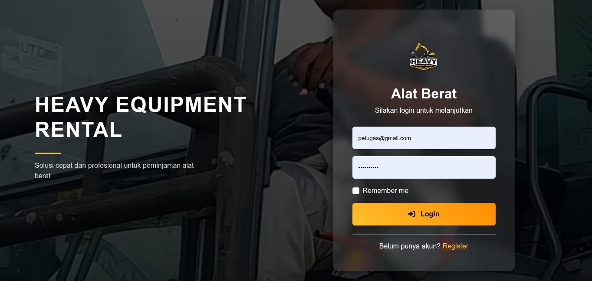
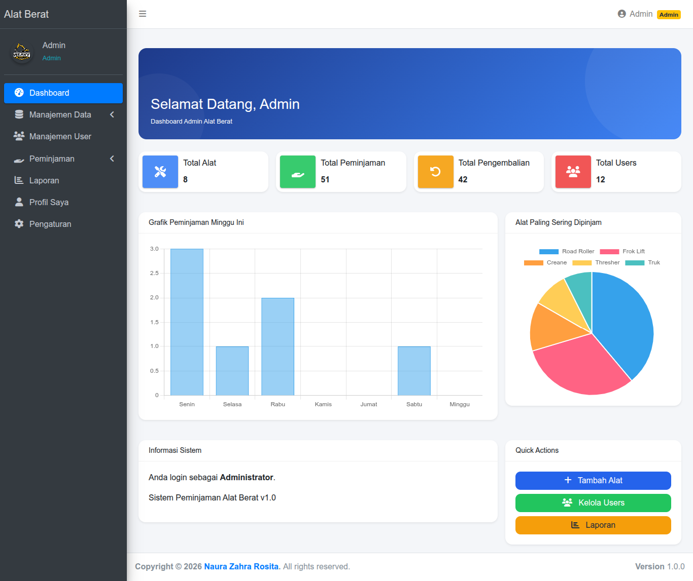
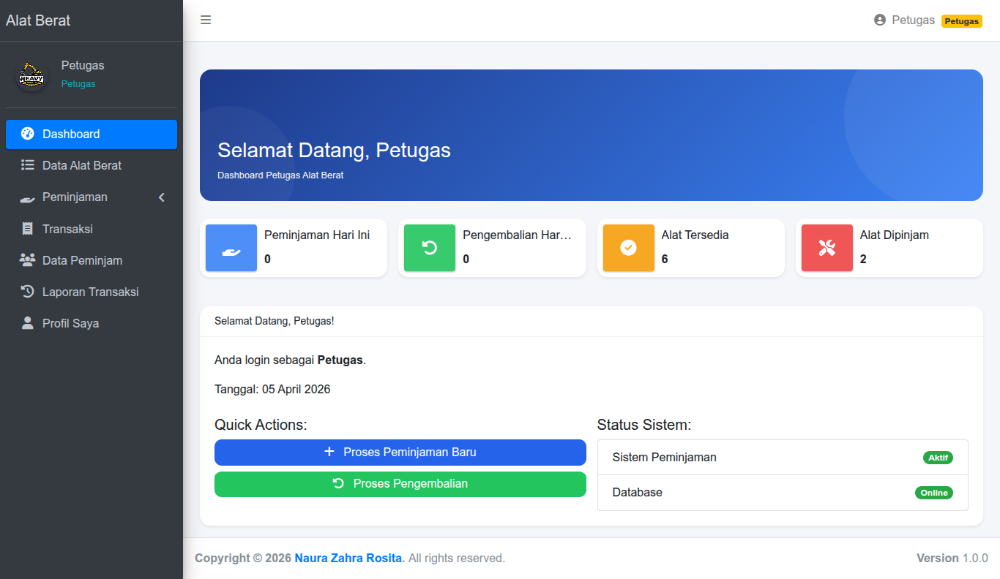
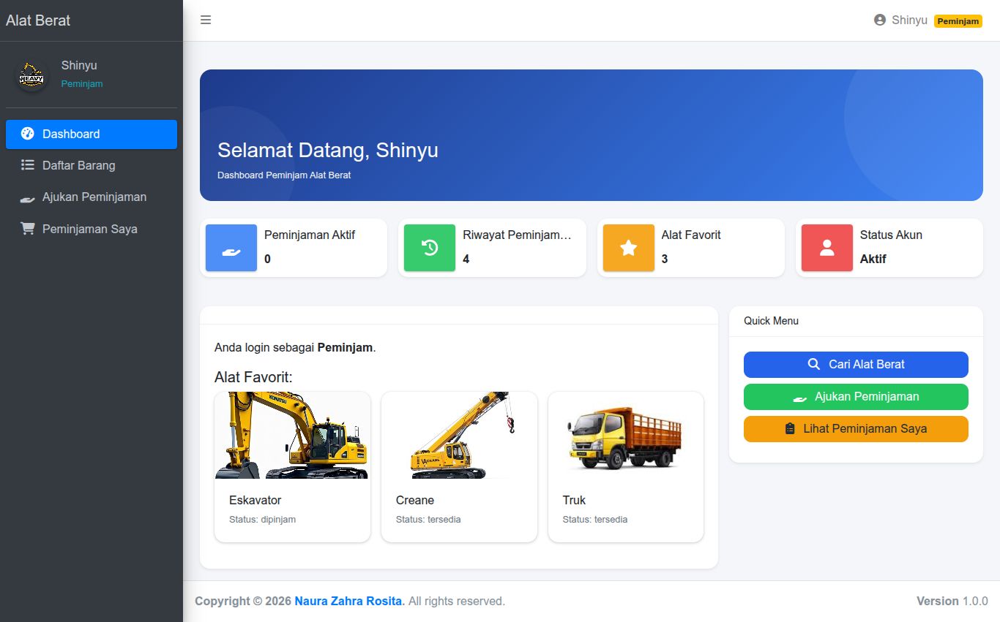
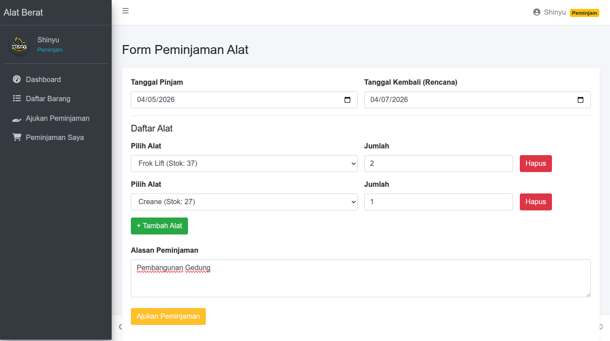
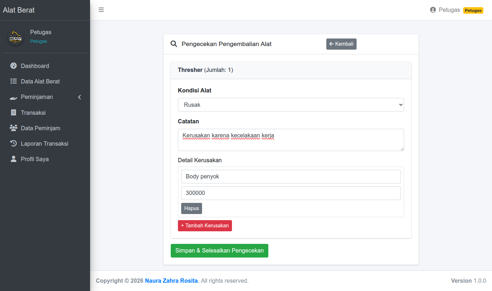
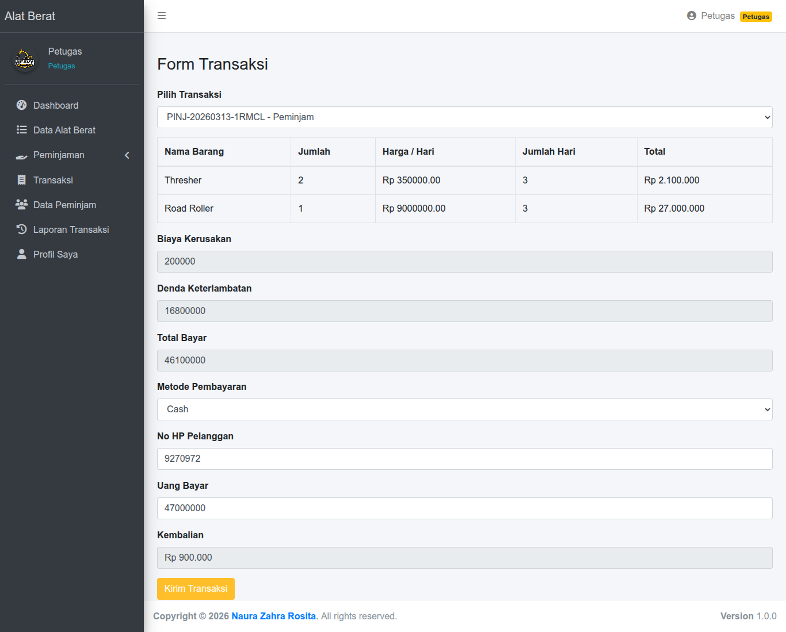

# DOCUMENTATION

## 1. Deskripsi Aplikasi

Sistem Peminjaman Alat Berat adalah aplikasi berbasis web yang digunakan untuk mengelola proses peminjaman alat berat secara terstruktur, mulai dari pengajuan, persetujuan, pengembalian, hingga transaksi dan laporan.

## 2. Tujuan

* Mempermudah proses peminjaman alat
* Mengelola stok alat secara otomatis
* Mencatat riwayat transaksi
* Meminimalisir kesalahan pencatatan manual

## 3. Fitur Utama

* Login & Register
* Peminjaman alat
* Pengembalian alat
* Manajemen stok
* Transaksi & denda
* Laporan

## 4. Role Pengguna

### 1. Admin

* CRUD User
* CRUD Alat
* CRUD Kategori
* Monitoring peminjaman & pengembalian
* Menghapus data peminjaman/pengembalian
* Melihat laporan transaksi

### 2. Petugas

* Menerima / menolak peminjaman
* Mengelola pengembalian
* Mengecek kondisi alat
* Membuat transaksi

### 3. Peminjam (User)

* Register & Login
* Mengajukan peminjaman alat
* Mengembalikan alat

## 5. Alur Sistem

### Alur Peminjam

1. User melakukan registrasi
2. User login sebagai peminjam
3. Masuk ke dashboard peminjam
4. Mengajukan peminjaman alat
5. Data masuk ke petugas

### Alur Petugas

6. Petugas menerima atau menolak pengajuan

   * Jika ditolak → proses selesai
   * Jika diterima → alat dipinjam
7. User mengembalikan alat
8. Petugas mengecek kondisi alat:

   * Jika baik → lanjut transaksi
   * Jika rusak → dikenakan denda
9. Petugas menyelesaikan transaksi

### Alur Admin

1. Admin login
2. Mengelola data user, alat, dan kategori
3. Memantau peminjaman & pengembalian
4. Mengelola laporan transaksi

## 6. Struktur Database

Tabel utama:

* users
* alat
* kategori
* peminjaman
* detail_peminjaman
* pengembalian
* transaksi
* detail_kerusakan
* log_aktivitas

## 7. ERD (Entity Relationship Diagram)

Relasi utama:

* users → peminjaman (1:N)
* peminjaman → detail_peminjaman (1:N)
* alat → detail_peminjaman (1:N)
* peminjaman → pengembalian (1:1)
* pengembalian → transaksi (1:1)
* transaksi → detail_kerusakan (1:N)
* kategori → alat (1:N)

## 8. Teknologi yang Digunakan

* Laravel
* MySQL
* Bootstrap

## 9. Cara Menjalankan Aplikasi

```bash
git clone https://github.com/username/repo.git
cd repo
composer install
cp .env.example .env
php artisan key:generate
php artisan migrate
php artisan serve
```

## 10. Screenshot

* Halaman login


* Dashboard






* Peminjaman


* Pengembalian


* Transaksi


## 11. Catatan

* Sistem sudah mendukung pengelolaan denda otomatis
* Role dibagi menjadi admin, petugas, dan peminjam
* Data transaksi dapat digunakan sebagai laporan